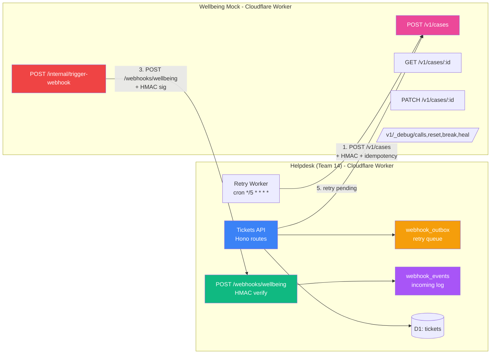
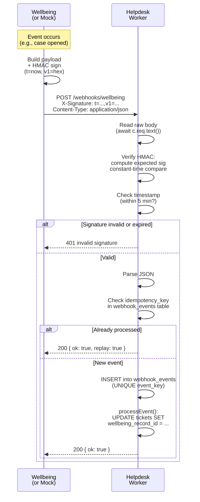
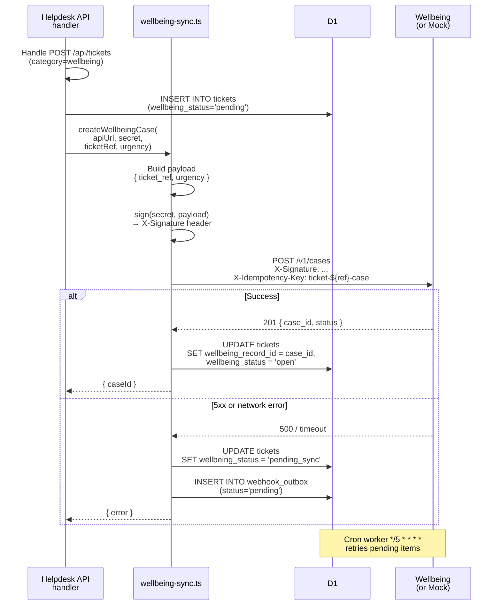
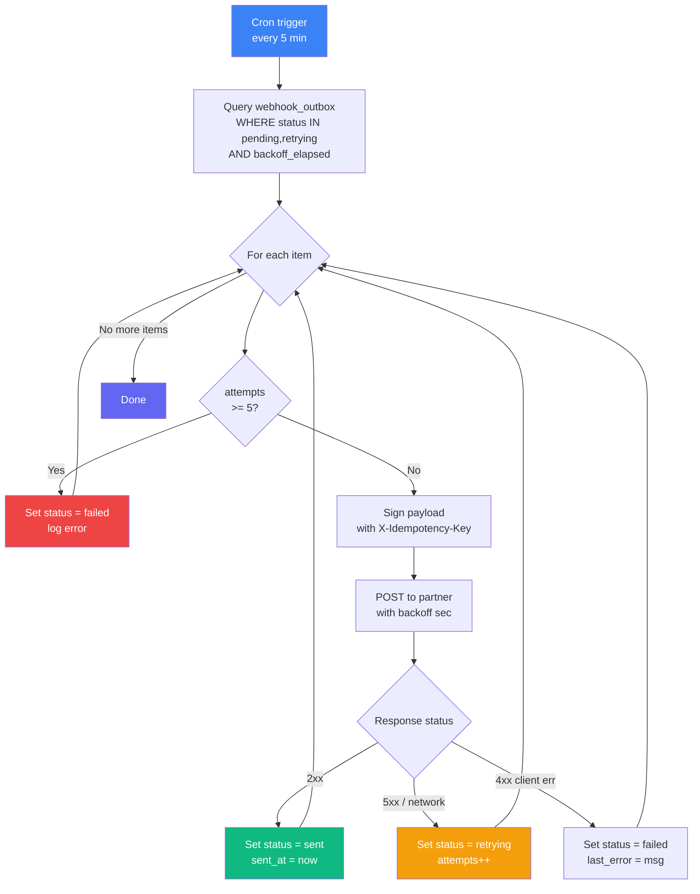
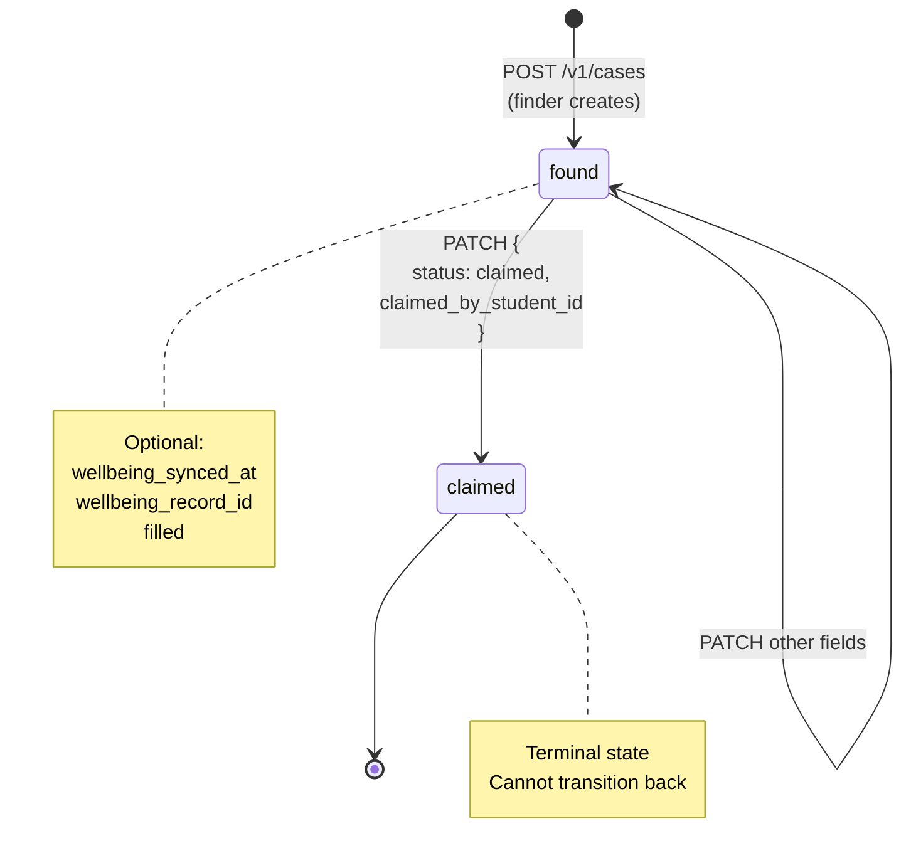
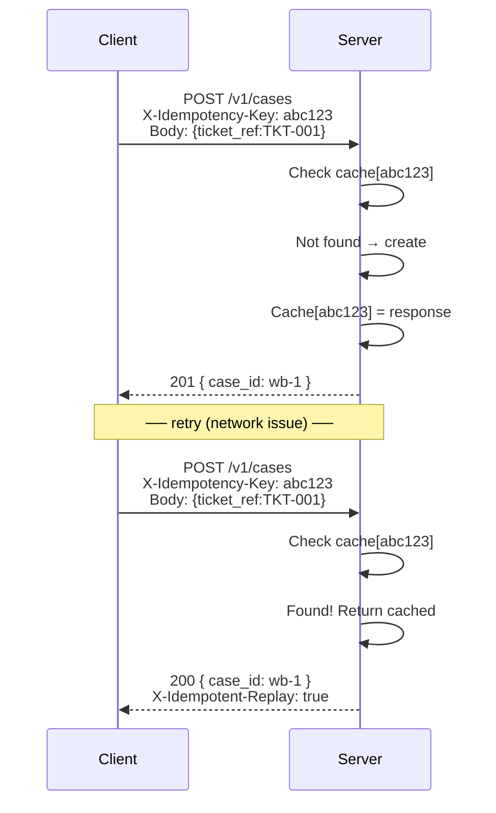
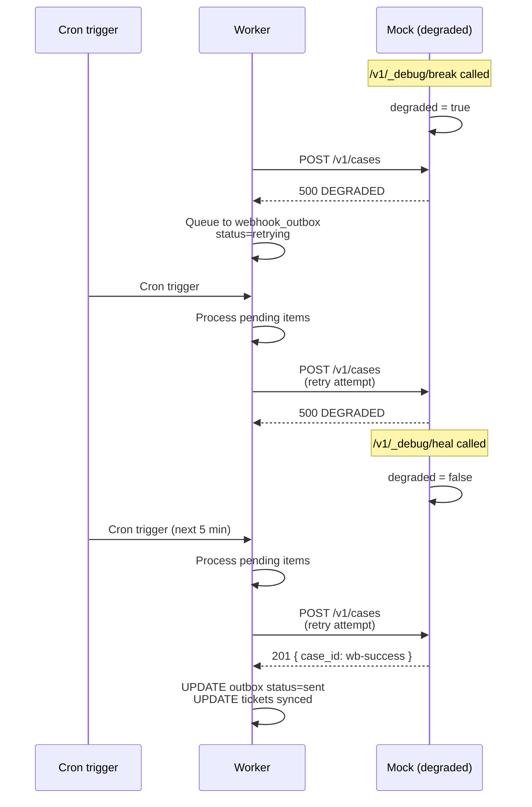

# Mermaid Diagrams for A5 Evidence

> Copy these into your evidence doc. They render in GitHub, VS Code, and most markdown viewers.

---

## 1. System Architecture



---

## 2. Webhook Flow (Provider → Consumer)



---

## 3. Consumer Flow (Helpdesk → Partner)



---

## 4. Retry Worker Flow



---

## 5. State Diagram (Item Status)



---

## 6. Idempotency Flow



---

## 7. Degradation & Recovery



---

## Usage in evidence doc

```markdown
## Architecture

[Insert Mermaid diagram 1 here]

## Flow

[Insert Mermaid diagram 2 or 3]

## Resilience

[Insert Mermaid diagram 7]
```

These render automatically in:
- GitHub markdown
- VS Code preview
- Obsidian
- Most MD viewers

If your viewer doesn't support Mermaid, see [DIAGRAMS_ASCII.md](./DIAGRAMS_ASCII.md) for fallback.
